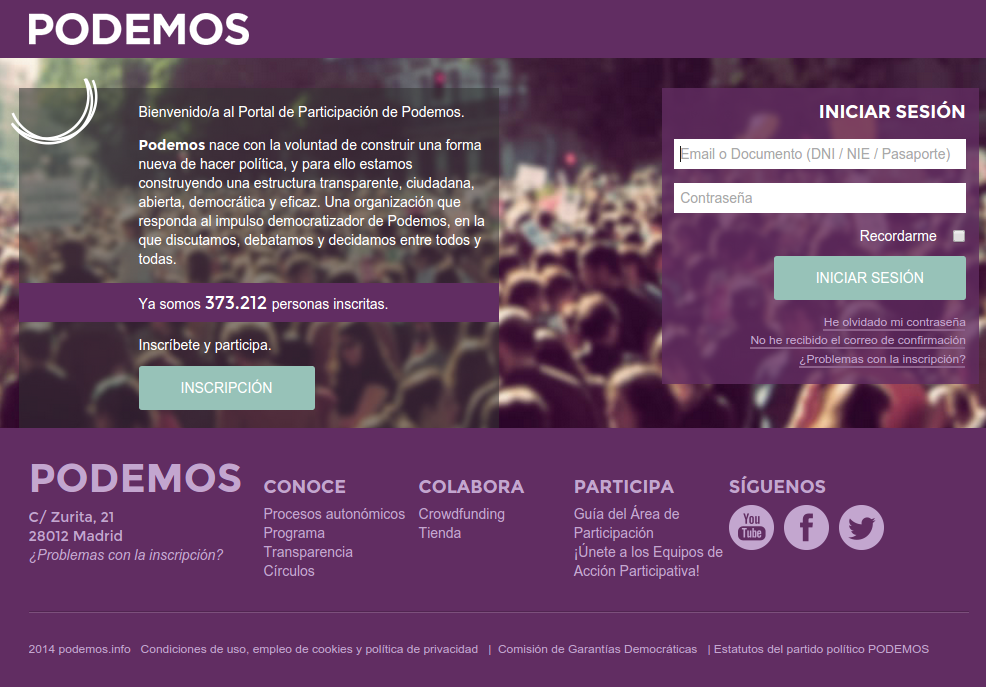
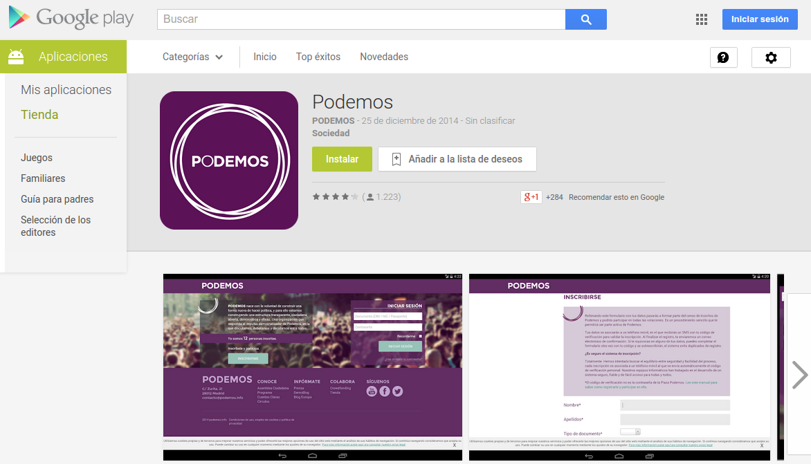
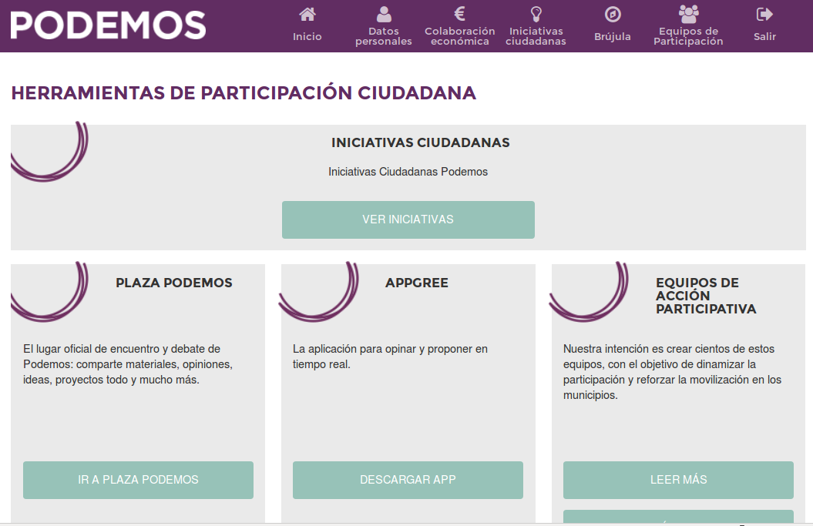

# Participa

El objetivo de esta aplicación es ofrecer el siguiente conjunto de herramientas:
Votaciones (integración con Agora Voting), Colaboraciones económicas (donaciones periódicas), Microcréditos (sistema de prestamos distribuidos), Notificaciones móviles (para dispositivos Android), entre otras funcionalidades.







## Funcionalidades

### Elecciones

Permite integrado un censo con Agora Voting: *Agora Voting es un software libre de votaciones que permite a cualquier organización realizar procesos electorales de forma segura, flexible, transparente y a un precio competitivo*. Permite que las elecciones se realicen en función a la localización del inscrito. En el caso de Podemos, se hace para diferenciar las elecciones de los ámbitos Municipales, Provinciales, Autonómicas y Estatales. A través de esta herramienta se han realizado todas las votaciones vinculantes de Podemos desde hace más de un año, más de 30 votaciones: documentos organizativos, eticos y políticos, elecciones de cargos internos (secretario general, consejos ciudadanos estatales, autonómicos y minicipales), las distintas fases e iniciativas del proyecto Impulsa, etc.

* https://agoravoting.com/

### Colaboraciones económicas

Permite que los usuarios inscritos puedan suscribir donaciones de forma periódica (mensual, trimestral o anual) por el importe que deseen. Permite que esta colaboración se produzca a través de transferencia bancaria o con tarjeta de crédito (conexión con Redsys). 

* http://transparencia.podemos.info/cuentas-claras/partido/ingresos
* http://transparencia.podemos.info/preguntas-frecuentes

### Microcréditos

Permite que usuarios (inscritos o no) den de alta microcréditos a la organización de forma puntual. 

* http://transparencia.podemos.info/preguntas-frecuentes

### Iniciativas Ciudadanas

Sistema de llegada de propuestas filtradas por votaciones con +1 bottom-up tomando como modelo el sistema planteado en el documento Organizativo de Podemos. Toma iniciativas de una categoría ("Propuestas") en la Plaza Podemos (subreddit de Podemos). 

### Equipos de Participación

Permite a los inscritos darse de alta como interesado en formar parte de equipos localizados geográficamente para fomentar la participación presencial y la formación sobre la participación digital.


### Verificación por SMS

Método de verificación utilizado por Podemos. Cuando un usuario se inscribe debe confirmar su correo electrónico y su teléfono móvil con un código que se le envía. 

### Blog (Brújula)

Sistema de publicación de noticia.

### Newsletter

Sincronización de usuarios entre sistemas (Participa y Sendy) para los distintos casos que puede haber de falta de sincronía entre las bases de datos, es decir, si un usuario se quiere dar de baja sólo de la newsletter o si quiere darse de baja completamente como usuario.

* https://sendy.co/

### Formularios y páginas estáticas

Sistema de integración con formularios basados en Wordpress (con el plugin Gravity Forms).

* http://www.gravityforms.com/

### Notificaciones móviles

Se ha hecho una aplicación en Android que puede enviar notificaciones a los dispositivos móviles. Se trata de una aplicación realizada con Phonegap, por lo que está planificado su desarrollo para IOS (iPhone e iPad).

* https://play.google.com/store/apps/details?id=info.podemos.participa&hl=en

### OpenID

Se ha configurado para que la aplicación sea un proveedor de OpenID, por lo que permite que otras aplicaciones autentifiquen contra los usuarios del censo. Se ha utilizado para la aplicación de "La Expresión del Cambio".

* https://laexpresiondelcambio.info/board/550096f30ee95e0000000007

## Instalación

Es una aplicación Ruby On Rails hecha con Rails 4.1 / Ruby 2.0.
Se recomienda hacerla en sistemas operativos GNU/Linux (nosotros usamos Ubuntu).
Para manejar las gemas recomendamos rvm o rbenv.
Para la BBDD recomendamos postgres, pero se puede usar también mysql/sqlite3.

Una vez se tenga configurado el rvm o rbenv los pasos a seguir serían los siguientes:

```
bundle install
cp config/database.yml.example config/database.yml
cp config/secrets.yml.example config/secrets.yml
rake db:migrate
rails server
```

Aparte de esto para algunas acciones utilizamos [resque](), una cola para trabajos asincronos.

## Tests

Se pueden comprobar los tests con

```
rake test
```

Todos deberían dar OK o SKIP (significa que se ipasa de alto, y que hay que programarlo). Una vez se libere el código se integrará con [travis-sci](http://travis-ci.org/).

## APIs externas

* Para las votaciones de los usuarios usamos [Agora Voting](https://agoravoting.com/), que han realizado una integración con la plataforma de Podemos. La configuración del secreto compartido se encuentra en una clave de `secrets.yml`. Documentación: [Sobre la integración, al momento de escribir esto](https://github.com/agoravoting/agora-core-view/blob/9dfbbf5252b2eb119463d2dcaa2c01391b232653/INTEGRATION.md), [Sobre la integración, versión más actualizada](https://github.com/agoravoting/agora-core-view/blob/master/INTEGRATION.md), [Sobre la API REST general de AgoraVoting](https://agora-ciudadana.readthedocs.org/).

* Para el envío de SMS usamos [esendex](http://esendex.es/). Puede comprobarse con el comando `rake esendex:validate[username,password,account_reference]`. La configuración de la autenticación se encuentra en unas claves de `secrets.yml`.

* Para el control de excepciones en staging y production usamos una instancia privada de la Asociación aLabs de [errbit](https://github.com/errbit/errbit), una aplicación libre basada en la API de [airbrake](https://airbrake.io/). Puede comprobarse la conexión con el servidor con el comando `rake airbrake:test`. La configuración de la autenticación se encuentra en unas claves de `secrets.yml`.

* Para la gestión de las colas de trabajo utilizamos [resque](https://github.com/resque/resque/), que usa como DDBB redis. Un comando útil para desarrollo es el de iniciar un worker: `rake resque:work`

* En desarrollo, para comprobar el envio de correos, utilizamos [mailcatcher](http://mailcatcher.me/), una gema que levanta un servidor SMTP en el puerto 1025 y una interfaz web para ver los correo s que se envían en en el puerto 1080. Para levantarlo ejecutar el comando `mailcatcher`

* Para el envío de correo en producción usamos [Amazon SES](http://aws.amazon.com/es/ses/). La configuración va en `config/secrets.yml`.

* Para descargar las últimas iniciativas ciudadanas en Plaza Podemos ejecutamos el comando: `rake podemos:reddit`

## Dependencias

Para ejecutar la aplicación en su totalidad hay que tener los siguientes servicios en funcionamiento:

```
sudo apt-get install libicu52                       # para manejar cadenas Unicode correctamente
sudo apt-get install postgres                       # para la base de datos, o mysql-server si lo prefieres
sudo apt-get install imagemagick                    # para la generación del captcha
sudo apt-get install redis-server                   # para la gestión de las colas de trabajo (resque)
sudo apt-get install libpq-dev                      # para la gema pg
sudo apt-get install qt5-default libqt5webkit5-dev  # para capybara (tests)
sudo apt-get install wkhtmltopdf                    # para generación de PDFs (microcreditos)
```

## Configuraciones

Se ha intentado que todas las configuraciones estén accessibles con los ficheros de configuración

```
config/databases.yml
config/secrets.yml
```

Ver ejemplos en `config/databases.yml.example` y `config/secrets.yml.example`.

## i18n

Para modificar los distintos idiomas, revisar los ficheros de `config/locales/`
Para agregar uno nuevo se deben seguir los siguientes pasos:
* Agregarlo en la línea de 'scope locale' en `config/routes`
* Agregarlo en la UI de cambio de idiomas del footer en `app/views/layouts/application.html.erb`
* Agregarlo en la configuración para idiomas válidos en `config/application.rb`

## Colaboraciones económicas

Para la forma de pago "Suscripción con Tarjeta de Crédito/Débito" hemos hecho una integración con Redsys.

Para esto hace falta tener una cuenta bancaria dada de alta en Redsys, tener acceso a su (entorno de pruebas)[https://sis-t.redsys.es:25443/canales/] y configurar los parámetros necesarios en config/secrets.yml


Se pueden ver los documentos desde los que se han partido para su implementación en `doc/redsys`.

2016
